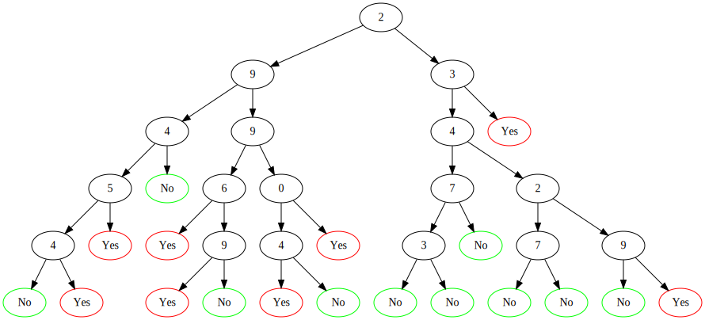
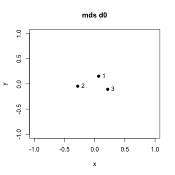
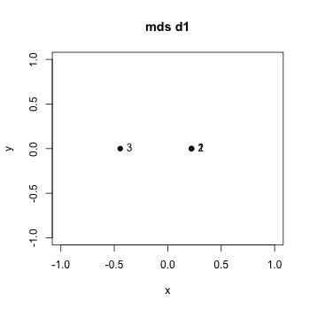
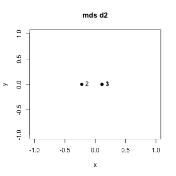
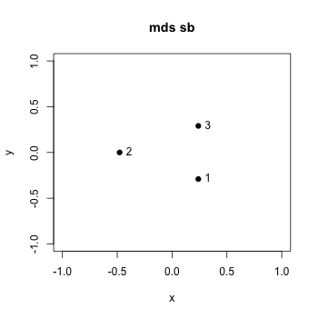

# metrices

We work with different metrices from the Banerjee and Chipman papers. I should describe them and give examples of trees that are close and far in each metric.

Let's look at the first 3 trees in the first ranger random forest (created in code/data-generation...R and loaded in docN , visualisation of trees created in createGraphViz.R):

tree 1 | tree 2 | tree 3
:---:|:---:|:---:
  |  | 

## d0 metric : split metric
For each tree collect all variables ever used as split variable. Compare trees by comparing the split variables they use. Trees that use the exact same split variables are very similar (maximum d0-similarity , minimum / minimal d0-dissimilarity, they don't have to be equal)

The three trees above have different sets of split variables with some shared split variables.

Currently, ranger splits nodes to decrease impurity. It sometimes / often splits nodes into 2 terminal nodes both yielding the same classification. I would not use this variable as the tree's split variables in the split metric. Can we suppress this splitting? Would also be relevant for the Shannon Banks metric, and the metric checking if observations land in a terminal node toghether or are separated into different terminal nodes. Should we suppress this splitting? Cf. James "An introduction ..." p. 314

Weighting: Currently luc lists the unique covariates used for splitting in the specified tree. This is like a 0/1 weighting of all covariates / variables / features. Instead of giving the weight 1 for a variable that is used as a split variable we could weight by the relative number of affected terminal nodes, I.e. the number of terminal nodes in the sub-tree with the location of the current split (using the variable in question) as a root. This has to be calculated for the different paths possible / when going from root to all terminal nodes. (Code required: counting terminal nodes in a binary tree, that need not be a full binary tree)

* so far it is not relevant when / where (distance from the root) and how often a variable is selected as split variable. But this information could be important to map dis/similarities : two trees sharing a split variable with one tree using it at the root or along each path to any terminal node and the other using it once near a terminal node make very different use of the shared split variable.

* consider variable importance in the ranger random forest. how relevant is it for a tree to have all important variables (using a cutoff to determine importance among the continuous importance values) among its split variables?

## d1 metric : partition metric
In a training data set of n observations there are n over 2 different pairs of observations. two observations may be placed in the same or in different terminal nodes of a classification tree. This is how a tree divides / partitions / clusters observations (the observations it was trained on or any other set of observations it can be applied to / the tree can classify). 

Compare trees by comparing how they cluster observations. Two trees are d1-similar if many pairs are treated the same in both trees: They fall down to the same terminal nodes or they fall into different terminal nodes.

The d1 metric sees no dissimilarity between trees 1 and 2.

Currently the d1 metric is just concerned with the binary situation of observations falling down to the same terminal node or not. In the situation of splits close to terminal nodes that result in the same classification for both its children observations might fall into different terminal nodes that are close and even have the same classification (cf d2 , fit metric). One could leave the binary setting and give a weight depending on the shortest connection between the nodes (from one terminal node up and then again down to the other terminal node)

## d2 : fit metric
Compare trees by comparing how they classify a set of observations. Two trees are d2-similar if they classify many observations the same.

We can do this on any set of observations, regardless of whether one / both / neither was trained on these observations. Currently I use the training observations (OOB observations are different for any two trees we might compare.).

The d2 metric sees no dissimilarity between trees 1 and 3.

We could build a set of observations we find especially relevant, or which is minimal in some sense.

## sb : Shannon Banks metric , tree metric
Each tree can be identified with its set of nodes and these can be seen as a subset of the nodes of a full binary tree.

Compare trees by comparing if they differ from the full binary tree in a similar way or not. This concerns only if there are splits or terminal nodes at each position of a full binary tree. Which split variable is used is not relevant at the moment. More elaborated versions of the tree metric are in Chipman.

All three are pairwise dissimilar, and they look further apart than in the d0 metric.
